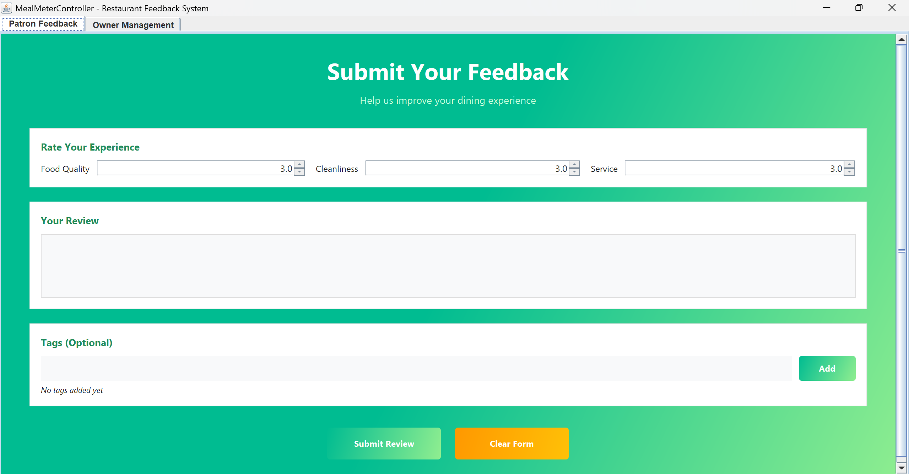
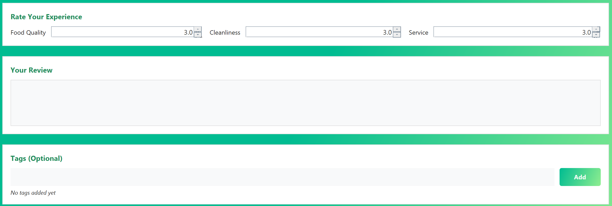
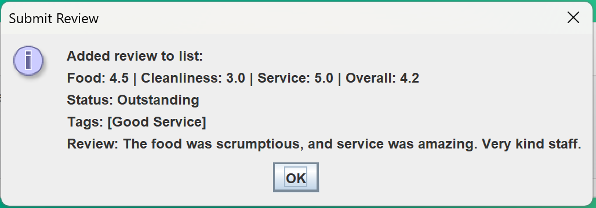
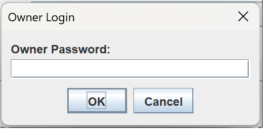
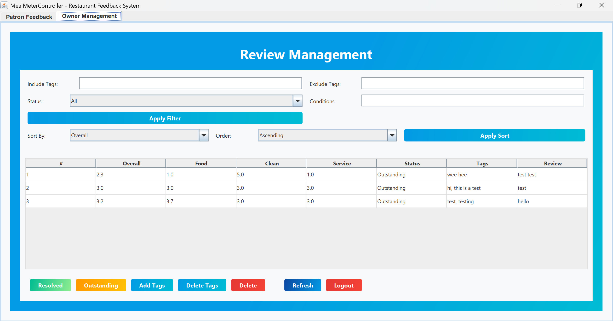
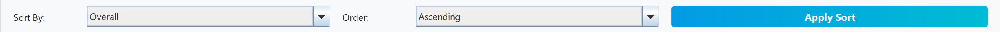
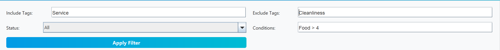
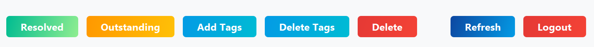

# MealMeter User Guide

MealMeter is a restaurant feedback application that allows patrons to submit structured feedback about their dining experience directly at the point of sale. Patrons can rate food quality, cleanliness, and service, leave a written review, and optionally add tags. Owners can then review, sort, filter, organise, and manage the submitted feedback from a separate management view.



## Table of Contents

- [Quick Start](#quick-start)
- [Video Demonstration](#video-demonstration)
- [Using MealMeter](#using-mealmeter)
  - [Submitting a Review](#submitting-a-review)
  - [Logging in as the Owner](#logging-in-as-the-owner)
  - [Viewing and Managing Reviews](#viewing-and-managing-reviews)
  - [Sorting Reviews](#sorting-reviews)
  - [Filtering Reviews](#filtering-reviews)
  - [Marking a Review as Resolved or Outstanding](#marking-a-review-as-resolved-or-outstanding)
  - [Adding Tags to an Existing Review](#adding-tags-to-an-existing-review)
  - [Deleting Tags from an Existing Review](#deleting-tags-from-an-existing-review)
  - [Deleting a Review](#deleting-a-review)
  - [Refreshing the Review Table](#refreshing-the-review-table)
  - [Logging out](#logging-out)
- [Data Storage](#data-storage)
- [FAQ](#faq)


## Quick Start

1. Ensure that Java `21` or above is installed on your computer.
2. Download the latest MealMeter release from the project's Releases page.
3. Copy the downloaded `.jar` file into the folder you want to use as MealMeter's home folder.
4. Open a terminal and `cd` into that folder.
5. Run the application with:

   ```bash
   java -jar <mealMeter-versionABC>.jar
   ```

   For example, if the downloaded file is named `mealMeter-v1.jar`, run:

   ```bash
   java -jar mealMeter-v1.jar
   ```

6. The MealMeter GUI should open in a few seconds.


## Video Demonstration

**Demo video placeholder:** insert the final demo video link here.

Example format:

```md
[Watch the MealMeter demo video here](<INSERT_DEMO_VIDEO_LINK_HERE>)
```

## Using MealMeter

MealMeter has two main views:

- **Patron Feedback**: used by diners to submit reviews.
- **Owner Management**: used by the restaurant owner to manage submitted reviews.

### Submitting a Review

Use the **Patron Feedback** tab to submit a new review.

To submit a review:

1. Set a score for **Food Quality**, **Cleanliness**, and **Service**.
   - Ratings range from **1.0 to 5.0**.
   - Ratings can be adjusted in **0.5-point** steps.
2. Enter your comments in the **Your Review** text box.
3. Optionally add tags in the tags field.
   - Click **Add** after typing each tag.
   - Added tags will be shown below the field.
4. Click **Submit Review** to save the review.
5. Click **Clear Form** if you want to reset all fields without submitting.

Notes:

- A written review is required by the GUI before submission.
- Tags are optional.
- Reviews are saved automatically after submission.





### Logging in as the Owner

To access owner-only features:

1. Click on the **Owner Management** tab.
2. A login pop-up will appear.
3. Enter the owner password and click **OK**.

The default owner password is:

```text
password
```

If the password is correct, the Owner Management view will open. If it is incorrect, access will be denied and the application will return to the Patron Feedback tab.



### Viewing and Managing Reviews

Once logged in, the **Owner Management** tab shows a table of submitted reviews. The table includes:

- review number
- overall score
- food score
- cleanliness score
- service score
- current status
- tags
- review text

From this screen, the owner can sort reviews, apply filters, mark reviews as resolved or outstanding, add or delete tags, delete reviews, refresh the table, and log out.



### Sorting Reviews

To sort the reviews:

1. In the **Sort By** dropdown, choose one of the available criteria:
   - `Overall`
   - `Food`
   - `Cleanliness`
   - `Service`
   - `Tag Count`
2. In the **Order** dropdown, choose either:
   - `Ascending`
   - `Descending`
3. Click **Apply Sort**.

The table will refresh to show the sorted review list.



### Filtering Reviews

You can filter reviews using one or more of the following fields:

- **Include Tags**: only show reviews that contain all listed tags.
- **Exclude Tags**: hide reviews that contain any listed tags.
- **Status**: show `All`, `Resolved`, or `Outstanding` reviews.
- **Conditions**: apply numeric filtering conditions.

Tags should be separated by commas, for example:

```text
slow service, crowded
```

Supported condition format:

```text
<criterion> <operator> <value>
```

Examples:

```text
food > 4
service == 5
cleanliness >= 3.5
overall < 2.5
```

Supported criteria are:

- `food`
- `cleanliness`
- `service`
- `overall`
- `tag count`

Partial matching is also available for criteria such as:
- `fo` matches `food`
- `tag` matches `tag count`

Supported operators are:

- `>`
- `>=`
- `==`
- `!=`
- `<`
- `<=`

You may enter multiple conditions separated by commas, for example:

```text
food >= 4, service >= 4
```

After entering your filter settings, click **Apply Filter**.

Notes:

- Leave fields blank if you do not want to use them.
- Use **Refresh** to return to the full review list after filtering or sorting.
- Condition input must match the implemented parser format exactly.



### Owner Review Management



### Marking a Review as Resolved or Outstanding

To update a review's follow-up status:

1. Select a review from the table.
2. Click **Resolved** to mark it as resolved.
3. Click **Outstanding** to mark it as unresolved again.

This is useful for tracking whether a review has already been followed up on by the restaurant.


### Adding Tags to an Existing Review

To add tags to a review that has already been submitted:

1. Select a review from the table.
2. Click **Add Tags**.
3. Enter one or more tags separated by commas.
4. Confirm the input.

MealMeter will add only the new tags. Existing matching tags will not be duplicated.

Example:

```text
priority, refund requested
```


### Deleting Tags from an Existing Review

To remove tags from a review:

1. Select a review from the table.
2. Click **Delete Tags**.
3. Enter one or more tags separated by commas.
4. Confirm the input.

Only matching tags will be removed. Non-existent tags will be ignored and reported back to the user.

Example:

```text
refund requested, waiting time
```


### Deleting a Review

To permanently delete a review:

1. Select a review from the table.
2. Click **Delete**.
3. Confirm the deletion when prompted.

Deleted reviews are removed from storage and cannot be recovered through the application.


### Refreshing the Review Table

Click **Refresh** to reload the full review list into the owner table.

This is useful when:

- you want to clear the current filtered or sorted view
- new reviews were submitted while you were logged in
- you want to return to the latest saved state in the main review list

### Logging out

Click **Logout** to end the owner session.

After logout:

- the application returns to the Patron Feedback tab
- the owner-only table is cleared from view
- owner-only actions are no longer available until you log in again

## Data Storage

MealMeter stores review data locally in:

```text
data/reviews.txt
```

This file is created automatically if it does not already exist. Reviews are saved automatically whenever:

- a patron submits a review
- an owner resolves or unresolves a review
- an owner adds or deletes tags
- an owner deletes a review

This means your data will still be available the next time you open the application from the same folder.

## FAQ

### Where are my reviews saved?

They are saved locally in `data/reviews.txt` relative to the folder where you run the application.

### How do I return to the full list after filtering or sorting?

Click **Refresh** in the Owner Management view.

### What is the default owner password?

The default password is `password`.

### Can patrons access the owner features?

No. Owner features require successful login through the Owner Management tab.

### Do I need to save changes manually?

No. MealMeter saves review changes automatically.


You have reached the end of the MealMeter User Guide.
