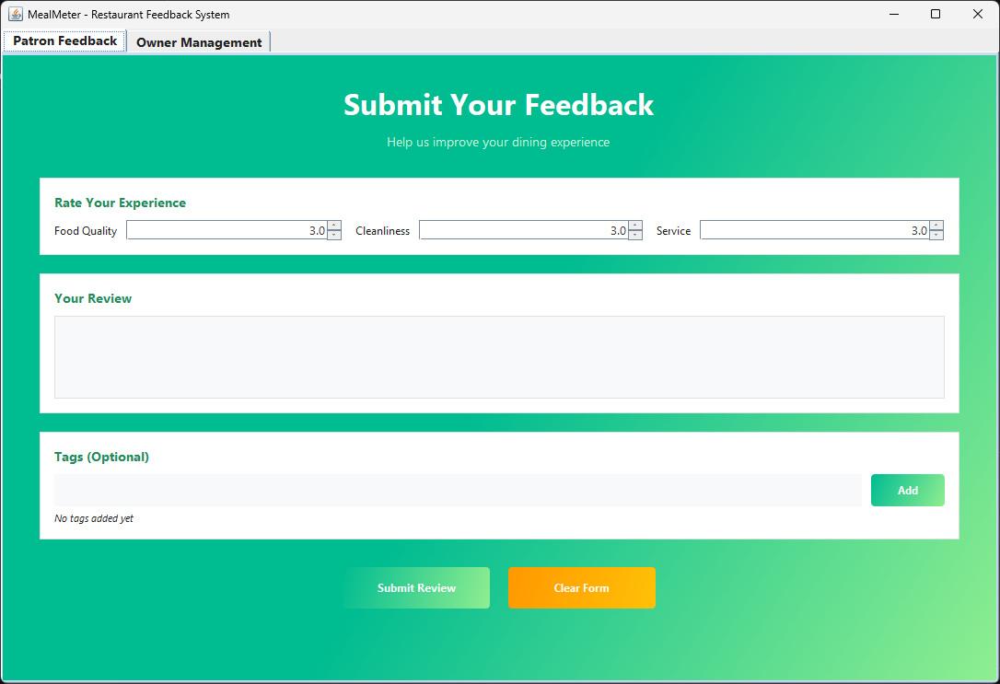
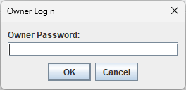
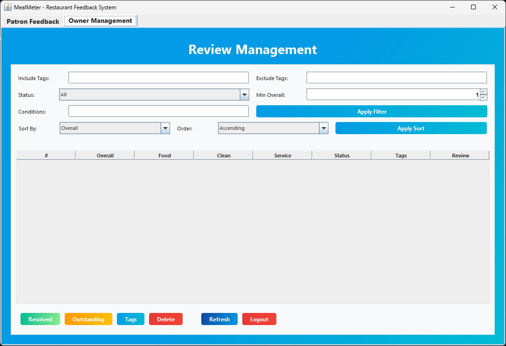

# MealMeter
# MealMeter User Guide
MealMeter is a restaurant feedback application that allows patrons to provide structured feedback about their dining
experience directly at the point of sale.

The application enables customers to rate key aspects of their visit and leave written comments that help restaurants
understand customer satisfaction and identify areas for improvement.

The system collects ratings in three primary categories:

- Food quality
- Cleanliness
- Service

In addition to ratings, patrons may submit a short written review describing their experience.
This information is recorded and made available to the restaurant for analysis and service improvement.

## User Interface
MealMeter is available via a Graphical User Interface (GUI). Below is a user guide on how to use MealMeter.

## Quick Start
1. Ensure you have Java `21` or above installed in your computer.
2. Download the latest release from [here](https://github.com/CS2103DE-Group-2/restaurant-review/releases).
3. Copy the file to the folder you want to use as the home folder for MealMeter.
4. Open a command terminal, `cd` into the folder you put the jar file in, and use the
   `java -jar restaurantReviewer-gui.jar` command to run the application. A GUI similar to the below should appear in a
   few seconds.

5. Refer to the [Features](#Features) section below for more details.

## Features
> MealMeter allows patrons to rate and review their dining experience by default. This review is stored in the database
and can be accessed via administrator features.
>
> Most features are only available to administrators, which will be
indicated in the features' respective walkthroughs.

### Adding a Review
You can add a review via the GUI interface seen in [Quick Start](#Quick-Start). To construct a review:
1. Leave a separate rating for `Food Quality`, `Cleanliness` and `Service`.
2. Leave a written review in the `Your Review` field.
3. Add tags in the `Tags` field. This can help the restaurant categorise your review,
   such as `good food` and `bad service`.
4. Click on `Submit Review` to submit the review, or `Clear Form` to clear the form.

> [!NOTE]
> The tags are optional.
> This feature does not require administrator privileges.

### Logging in
You can log in to the application via the GUI interface. On the `Patron Feedback` screen, click on `Owner Management`.
A separate window will appear, requesting a password as seen below.

Enter `password` in the password field and click on `Login`. This will grant the user administrator privileges, which
grants access to all the features below. You will be presented with the `Owner Management` screen.

### Sorting Reviews
You can sort the reviews by `Food Quality`, `Cleanliness`, `Service` and `Overall` ratings, as well as the number of
tags associated with the reviews `Tag Count`. The reviews may be sorted in `Ascending` or `Descending` order.

These sorting criteria can be changed by using the `Sort By:` and `Order:` dropdown menus. Click on the `Apply Sort`
button to apply the sorting criteria specified in the dropdown menus.

### Filtering Reviews
Reviews can be filtered via multiple criteria.
1. Filter by tags, which will filter reviews that contain/do not contain the specified tags.
   Specify the tags in the `Include Tags` and `Exclude Tags` fields. Separate tags with commas.
2. Filter by review status `Resolved` and `Outstanding` with the `Status` dropdown menu.
3. Specify specific equality checks for numeric values in the review. These include:
- `Food Quality`
- `Cleanliness`
- `Service`
- `Overall`
- `Tag Count`
  These `Condition`s are specified in the `Conditions` field.

> [!NOTE]
> **Notes about the condition format:**\
> `CONDITION` is in the format `CRITERION COMPARATOR VALUE`.
> - `CRITERION` can be `food scores`, `cleanliness scores`, `service scores`, `overall scores` or `tag count`.
> - `COMPARATOR` can be `>`, `>=`, `==`, `!=`, `<` or `<=`.
> - `VALUE` can be any number.
> - The order of components matters.
> - A space must separate all components.

### Adding and Deleting Tags
Tags can be added and deleted via the `Tags` button, located at the bottom of the `Owner Management` screen. Select a
review, then click on the `Tags` button to add or delete tags. Prefix a tag to delete with `-`.
> [!NOTE]
> **Note about prefixing tags:**\
> Prefixing a tag with `-` will remove the tag from the review.
> e.g. To remove a tag `good food`, input `-good food` into the text field.

Tags are comma-separated.
